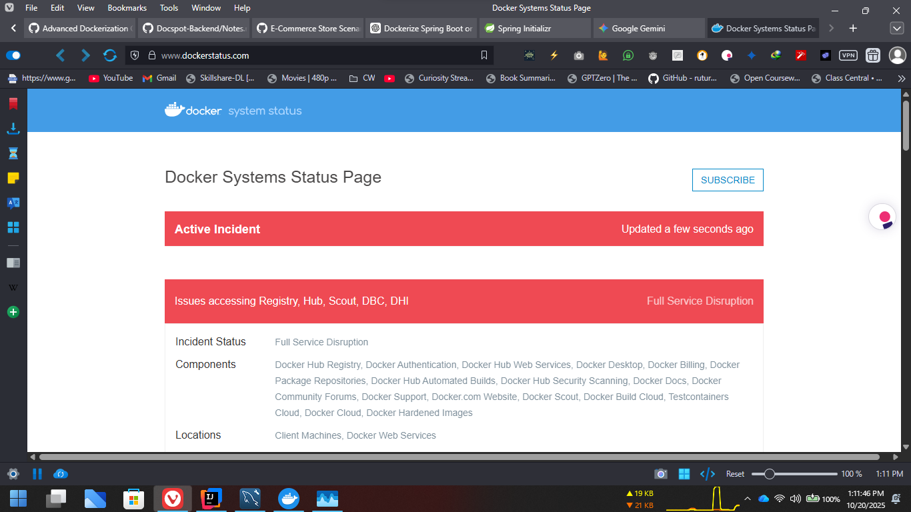

# 🧩 Advanced Dockerization Challenge — Spring Boot + MySQL + Flyway

## 🚀 Application Overview

This project is a **Spring Boot REST API** containerized using **Docker** and orchestrated with **Docker Compose**.  
It uses **MySQL** as the database and **Flyway** for database versioning and migration management.  

The application exposes a single endpoint:

```

GET [http://localhost:8080/users](http://localhost:8080/users)

````

This endpoint returns all dummy user data populated via Flyway migrations from the MySQL database.

---

## ⚙️ My Approach

I followed a **step-by-step, incremental approach** to build and verify each component before combining them.

### **Step 1 — Backend Setup**
- Created a **Spring Boot application** using:
  - Spring Web  
  - Spring Data JPA  
  - MySQL Driver  
  - Flyway Core  
- Configured Flyway for schema versioning and migration tracking.
- Added two migrations:
  - **V1__init_sql_users.sql** → Created the `users` table.
  - **V2__populate_dummy_data.sql** → Inserted multiple dummy users.

---

### **Step 2 — Dockerizing the Application**
- Created a **multi-stage Dockerfile**:
  - Stage 1: Used Maven image to build the Spring Boot JAR.
  - Stage 2: Used a lightweight JDK runtime image to run the app.
- Initially connected the Spring Boot container to the **local MySQL database** to verify that Flyway and JPA worked correctly inside Docker.

---

### **Step 3 — Docker Compose Integration**
- Created a `docker-compose.yml` file with:
  - **app** → Spring Boot container.
  - **db** → MySQL 8.0 container.
- Added a **named volume (`mysqldata`)** to persist database data.
- Updated the application’s connection string to use the Docker service name `db` instead of `localhost`.

---

### **Step 4 — Handling Race Condition**
- Initially faced a **race condition**: Spring Boot tried to connect before MySQL was fully initialized.
- Solved it by adding a **MySQL health check** to ensure the database is ready before the app starts.

#### ✅ Health Check Example (inside `docker-compose.yml`):
```yaml
db:
  image: mysql:8.0
  container_name: mysql_db
  restart: always
  environment:
    MYSQL_ROOT_PASSWORD: root
    MYSQL_DATABASE: hackathondb
  ports:
    - "3306:3306"
  healthcheck:
    test: ["CMD-SHELL", "mysqladmin ping -h localhost -u root -proot | grep 'mysqld is alive'"]
    interval: 10s
    timeout: 5s
    retries: 5
  volumes:
    - mysqldata:/var/lib/mysql

app:
  build: .
  container_name: spring_app
  ports:
    - "8080:8080"
  depends_on:
    db:
      condition: service_healthy
````

This ensures the Spring Boot app waits until MySQL reports it’s healthy before starting.

---

### **Step 5 — Persistence Test**

* Verified persistence by running:

  ```bash
  docker compose down
  docker compose up
  ```
* The dummy users remained in the database, confirming that **persistent storage** works as intended.

---

## 🧠 Endpoints

| Method  | Endpoint | Description                                                       |
| ------- | -------- | ----------------------------------------------------------------- |
| **GET** | `/users` | Returns all dummy users from MySQL populated by Flyway migrations |

### Example Response:

```json
[
  { "id": 1, "username": "hamza_ali", "email": "hamza@example.com", "created_at": "2025-10-20T10:00:00" },
  { "id": 2, "username": "john_doe", "email": "john.doe@example.com", "created_at": "2025-10-20T10:00:00" },
  { "id": 3, "username": "jane_smith", "email": "jane.smith@example.com", "created_at": "2025-10-20T10:00:00" }
]
```

---

## 🐳 Persistence Verification

* The MySQL database uses a **Docker named volume**:

  ```yaml
  volumes:
    - mysqldata:/var/lib/mysql
  ```
* Tested by stopping and restarting containers — data persisted correctly.

---

## 🧾 How to Run This Project

### 1️⃣ **Clone the Repository**

```bash
git clone https://github.com/Hamza-ali1223/HacktoberFest-2.0.git 
cd <submissions/team-lowkeylegends/task06_Advanced_Dockerization_Challenge
```

### 2️⃣ **Build and Run the Containers**

```bash
docker compose up --build
```

This will:

* Build the Spring Boot app image
* Start the MySQL container with `hackathondb`
* Apply Flyway migrations automatically
* Launch the backend after MySQL is healthy

### 3️⃣ **Access the App**

Visit:

```
http://localhost:8080/users
```

You’ll see dummy users inserted by Flyway migrations.

---

## ⚠️ Notes and Recommendations

* **Eduroam Wi-Fi Notice:**
  If you’re connected to *Eduroam Wi-Fi*, downloading Maven dependencies during the first build can take **45 minutes to 1 hour** due to restricted network speeds.
* 
  👉 It’s recommended to use a **personal hotspot or faster Wi-Fi** for the initial Maven build.

* **Flyway Migrations:**
  Flyway automatically detects and executes all SQL migration scripts in `src/main/resources/db/migration`, following the naming pattern:

  ```
  V1__init_sql_users.sql
  V2__populate_dummy_data.sql
  ```

---

## 🔴 Main Issue Occurred That Didn’t Allow Working on Optional Tasks

While preparing for the **optional CI/CD and Docker Hub tasks**, Docker Hub services experienced a **full outage**.

### 🧠 Root Cause:

The **Docker Hub Registry and Authentication services** were down globally, resulting in:

* Failed login attempts (`docker login` and GitHub Actions authentication).
* Inability to push images (`docker push`).
* Broken automated build pipelines.

### 📸 Reference:

A screenshot from the Docker Status Page showed:
 
> **Active Incident — Full Service Disruption**
> *Issues accessing Registry, Hub, Scout, DBC, DHI*
> *(Affecting Docker Hub Registry, Authentication, and Automated Builds)*

Because of this outage, the optional CI/CD steps (image push and GitHub workflow verification) i will add the github workflow though kindly check it out

---
