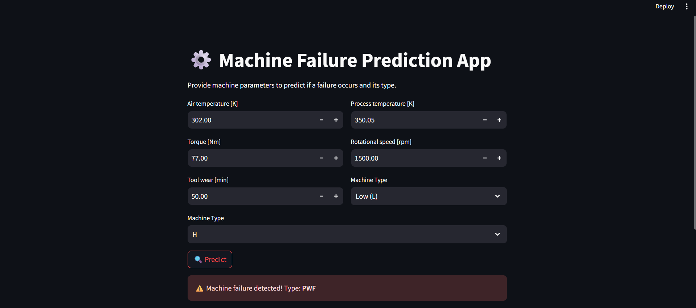

# Machine Failure Prediction for Agricultural Equipment

This project predicts **machine failure** and its **type** for agricultural equipment using a trained machine learning pipeline. The model is deployed with **Streamlit** for easy web-based interaction.

---



## 🚀 Features

* Predicts whether a machine failure occurs.
* Identifies the type of failure:
    * `TWF` – Tool Wear Failure
    * `HDF` – Heat Dissipation Failure
    * `PWF` – Power Failure
    * `OSF` – Overspeed Failure
    * `RNF` – Random Failure
* Web interface using **Streamlit** for user-friendly inputs.
* Preprocessing pipelines handle feature engineering automatically.

---

## 📂 Project Structure

failure_prediction_for_agricultural_equipment/
│
├── configuration/
│ └── config.py # Preprocessing and pipeline code
├── final_pipeline.pkl # Trained model
├── streamlit_app.py # Streamlit interface
├── README.md
└── requirements.txt # Python dependencies

---

## 🛠 Installation & Setup

1.  **Clone the repository:**
    ```bash
    git clone [https://github.com/AWS-Cloud-Club-Mehran-UET/HacktoberFest-2.0.git]
    cd failure_prediction_for_agricultural_equipment
    ```

2.  **Install dependencies:**
    ```bash
    pip install -r requirements.txt
    ```

---

## 🏃‍♀️ How to Run

1.  **Start the Streamlit app:**
    ```bash
    streamlit run streamlit_app.py
    ```

2.  **Open the app:** Open the browser URL that Streamlit provides (usually `http://localhost:8501`).

---

## 📋 How to Use the App

1.  Fill in the machine parameters on the web interface:
    * **UDI** (can be a dummy value)
    * **Product ID** (can be a dummy value)
    * **Type** (L, M, or H)
    * **Air temperature [K]**
    * **Process temperature [K]**
    * **Rotational speed [rpm]**
    * **Torque [Nm]**
    * **Tool wear [min]**

2.  Click the **"Predict"** button to see the results.

---

## 🧰 How It Works

The application uses a pre-trained `scikit-learn` pipeline (`final_pipeline.pkl`) to process user inputs and make predictions.

1.  **Input:** You provide the machine parameters through the Streamlit interface.
2.  **Preprocessing:** The pipeline automatically handles:
    * **Feature Engineering:** Creates new features like `Temp Ratio` (Process Temp / Air Temp), `Power` (Torque * Speed), and `Resistance` (Tool Wear * Torque).
    * **Encoding:** Converts the categorical `Type` feature (L, M, H) into a numerical format.
3.  **Prediction:** The processed data is fed into a **Multi-Output Classifier** which predicts two things:
    * A **failure flag** (0 for No Failure, 1 for Failure).
    * The specific **failure type** (TWF, HDF, PWF, etc.) if a failure is predicted.
4.  **Output:** The Streamlit app displays the prediction (e.g., "No Failure" or "Failure Detected: Power Failure") in a user-friendly format.

---

## 📦 Dependencies

The main dependencies are listed in `requirements.txt` and include:
* `pandas`
* `numpy`
* `scikit-learn`
* `streamlit`