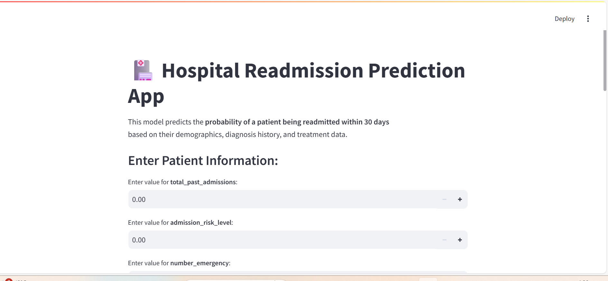
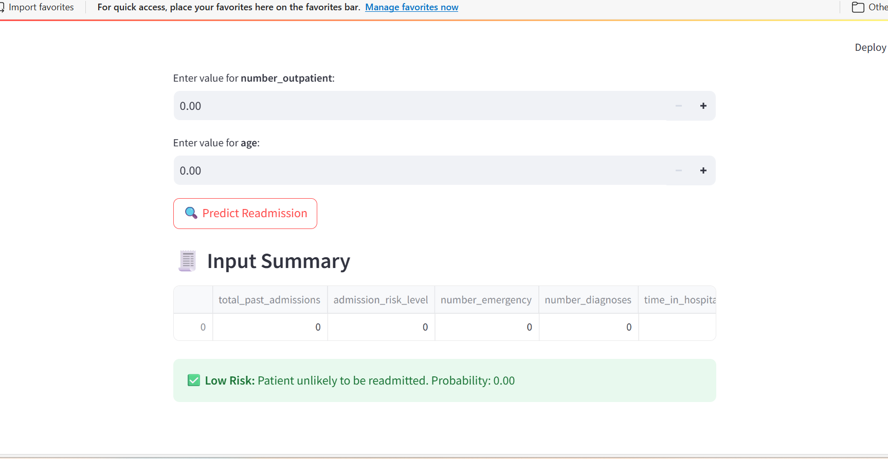

🏥 Hospital Readmission Prediction System
📘 Overview

Hospital readmissions within 30 days are a major challenge in healthcare — they increase both costs and reflect potential gaps in patient care.

This project builds a machine learning model to predict whether a patient will be readmitted within 30 days based on their demographics, diagnosis codes, and medical history.

The final system includes:

A trained XGBoost, RandomForest classifier and logistRegression optimized 

A Streamlit web app for interactive predictions

Feature engineering for medical and risk-based indicators

🚀 Features

✅ Predicts 30-day hospital readmission risk
✅ User-friendly Streamlit interface
✅ Model trained with XGBoost Lastly

🧠 Dataset

The dataset contains patient records with features such as:

Demographics (age, gender, race)

Diagnoses (diag_1_category, chronic_illness_flag)

Procedures & Medications (num_procedures, num_medications, polypharmacy)

Admissions Info (time_in_hospital, number_emergency, etc.)

Target: readmitted →

1 = Readmitted within 30 days

0 = Not readmitted

🧩 Features Used in the Final Model
Feature	Description
total_past_admissions	Count of past hospital admissions
admission_risk_level	Calculated risk category for admission
number_emergency	Number of emergency visits
number_diagnoses	Total diagnoses recorded
time_in_hospital	Duration of current hospital stay
num_medications	Total prescribed medications
polypharmacy	Indicator if num_medications > threshold
diabetesMed	Whether diabetes medication was prescribed
num_lab_procedures	Total lab procedures done
number_outpatient	Number of outpatient visits
age	Patient age group encoded numerically

💾 Saving the Model
import pickle

with open("xgb_readmission_model.pkl", "wb") as f:
    pickle.dump(xgb, f)

🌐 Streamlit App
Run the app:
streamlit run main.py

